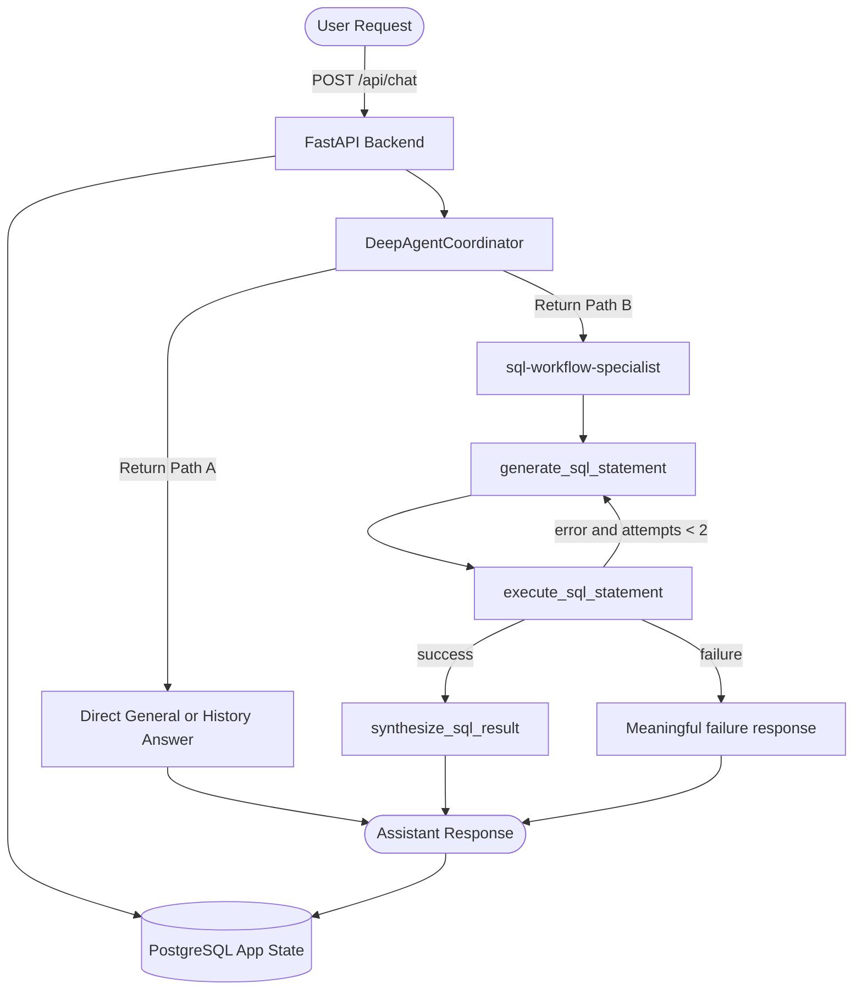

```mermaid
graph TD
    User([User Request]) --> |POST /api/chat| API[FastAPI Backend]

    API --> History[(PostgreSQL App State)]
    API --> Coordinator[DeepAgentCoordinator]

    Coordinator -->|Return Path A| General[Direct General or History Answer]
    Coordinator -->|Return Path B| SQLSubagent[sql-workflow-specialist]

    SQLSubagent --> SQLGen[generate_sql_statement]
    SQLGen --> SQLExec[execute_sql_statement]
    SQLExec -->|error and attempts < 2| SQLGen
    SQLExec -->|success| SQLSynth[synthesize_sql_result]
    SQLExec -->|failure| SQLFail[Meaningful failure response]

    General --> Output([Assistant Response])
    SQLSynth --> Output
    SQLFail --> Output

    Output --> History
```
